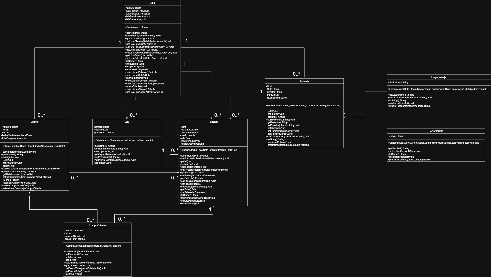

# Sistema de Gestión de Cine — Java POO

Sistema integral de gestión para salas de cine desarrollado en **Java** aplicando los principios de la **Programación Orientada a Objetos (POO)**. Permite la administración de cartelera, configuración de salas y funciones, gestión de clientes y venta de entradas con cálculo automático de recaudación y control de ocupación en memoria.

---

## 🏛️ Arquitectura y Diagrama de Clases

El sistema modela las entidades del dominio respetando abstracción y separación de responsabilidades:



---

## 🚀 Conceptos de POO y Diseño Implementados

* **Herencia y Polimorfismo:**
  * Clase abstracta base `Pelicula` con atributos comunes (`nombre`, `duracion`, `genero`).
  * Subclases `Largometraje` (extiende con tiempo de tráiler) y `Cortometraje` (extiende con indicador booleano de animación).
* **Encapsulamiento y Control de Estado:**
  * Atributos privados con métodos de acceso/mutación.
  * La clase `Sala` gestiona de forma autónoma su capacidad total y cupo disponible según las entradas vendidas.
* **Composición y Agregación de Entidades:**
  * `Funcion`: Asocia una `Pelicula`, una `Sala` y un horario asignado.
  * `CompraCliente`: Modela la transacción registrando el `Cliente`, la `Funcion` seleccionada, la cantidad de entradas y el monto final.
* **Gestión de Colecciones en Memoria:**
  * Uso de `ArrayList<T>` en la clase orquestadora `Cine` para coordinar el catálogo de películas, las salas, la cartelera de funciones y el histórico de transacciones.
* **Capa de Soporte y Validaciones:**
  * Módulo `Utilidades` para lectura y control estricto de tipos de datos por consola (números enteros, decimales, límites de rango y cadenas no vacías).

---

## 🛠️ Funcionalidades Principales

* 🎬 **Administración de Películas:** Alta de largometrajes y cortometrajes con validación de datos técnicos.
* 🚪 **Gestión de Salas:** Configuración de salas y control de capacidad física para el aforo.
* 🕒 **Programación de Funciones:** Asignación de películas a salas en horarios determinados con validación de disponibilidad.
* 🎟️ **Venta de Entradas:**
  * Selección guiada de funciones disponibles.
  * Verificación de cupos restantes en sala antes de confirmar la compra.
  * Actualización en tiempo real de la capacidad disponible.
* 📊 **Reportes y Recaudación:**
  * Listado completo de cartelera y funciones activas.
  * Reporte de compras por cliente.
  * Cálculo del total recaudado por entradas vendidas.

---

## 💻 Requisitos y Ejecución

* **JDK:** Java SE 17 o superior.
* **IDE recomendado:** IntelliJ IDEA o Eclipse.

### Compilación y ejecución por consola:

```bash
# Compilar todas las clases dentro de src
javac -d bin src/cine/*.java

# Ejecutar el programa principal
java -cp bin cine.Main
```
> 🎓 Contexto académico: Proyecto integrador final para la materia Programación Orientada a Objetos — Carrera de Analista de Sistemas.
